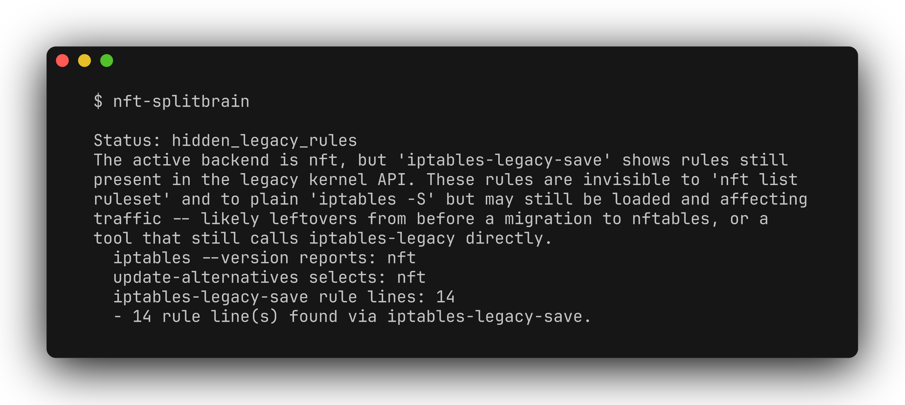

# nft-splitbrain

[](README.md) [](README.zh-CN.md)

检查 Linux 主机上的 `iptables-legacy`、`iptables-nft` 与 nftables 是否存在后端不一致，帮助发现日常检查命令看不到的另一套规则。整个过程不修改防火墙。



[演示视频](docs/demo.mp4)

## 检查内容

- 在可用时，对比 `iptables --version` 与 `update-alternatives --display iptables`。
- 当前选择 nft 时，通过 `iptables-legacy-save` 检查 legacy 内容。
- 当前选择 legacy 时，通过 `nft list ruleset` 检查 nftables 内容。
- 对可识别的权限错误、无法确定的当前后端单独报告，不把它们当作检查通过。

## 安装与运行

需要 Linux、Python 3.9+，以及主机实际使用的防火墙工具（iptables 1.8+ 和/或 nftables）。无 Python 运行时依赖。

```bash
git clone https://github.com/zhuhroscar-tech/nft-splitbrain.git
cd nft-splitbrain
python3 -m venv .venv
source .venv/bin/activate
python -m pip install -e ".[dev]"
```

```bash
nft-splitbrain
sudo .venv/bin/nft-splitbrain --json
```

读取规则集通常需要 root 或 `CAP_NET_ADMIN`。显式指定虚拟环境路径，可以避免 sudo 的 `PATH` 找不到命令；程序不会自行提权。也可从[发布页面](https://github.com/zhuhroscar-tech/nft-splitbrain/releases)下载 `.pyz`，核对同版本的 `SHA256SUMS.txt` 后运行 `python3 nft-splitbrain.pyz`。

退出码 `0` 包括 `ok`、`no_backend_found`、`nft_only_no_iptables`；`2` 包括冲突、未知后端及可识别的权限错误。**退出码为零不等于通过防火墙安全审计**，请查看具体状态。

## 安全与限制

不增删规则、不清空或恢复规则集、不切换后端，无网络请求和遥测。结果仅反映当前 network namespace 的快照，不模拟流量，也不构成完整的主机或 IPv6 审计。规则集行数只是粗略的内容存在性判断，不是语义上的规则数量；部分命令错误可能无法被权限检测识别。

处理问题前，先确认规则归属（如 Docker、firewalld），检查两套后端，再规划迁移。不要在远程主机上直接清空规则或盲目切换后端，以免失去连接。

## 开发与卸载

```bash
python -m pytest -q
python -m pip uninstall nft-splitbrain
```

[发布文件](https://github.com/zhuhroscar-tech/nft-splitbrain/releases) · [MIT 许可证](LICENSE)
